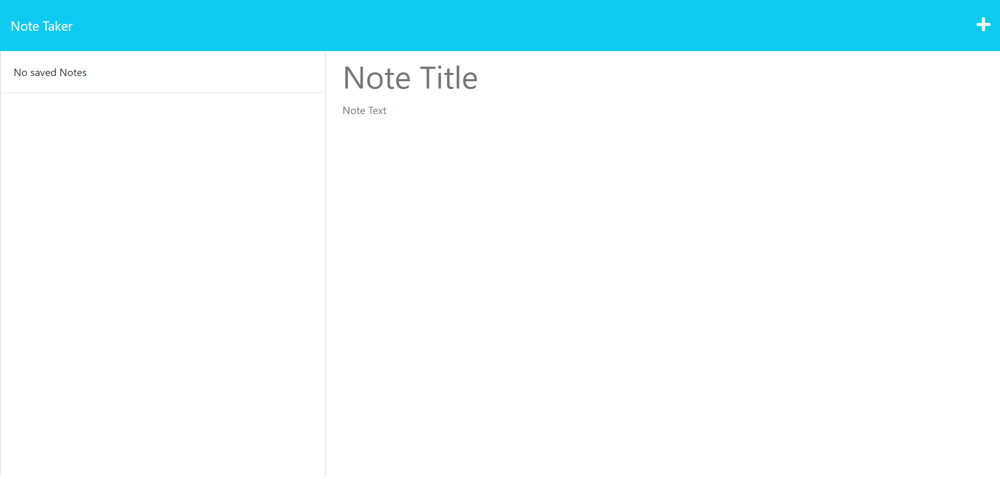

# Note Taker

## Description

Note Taker is a web-based application that allows users to create, save, and view notes. It utilizes HTML, CSS, and JavaScript on the front end, and Node.js with Express.js on the back end. The application stores notes in a JSON file using the fs module.

## Table of Contents

- [Installation](#installation)
- [Usage](#usage)
- [API Routes](#api-routes)
- [Technologies](#technologies)
- [License](#license)

## Installation

To install the Note Taker application, follow these steps:

1. Clone the repository: `git clone <repository-url>`
2. Navigate to the project's root directory: `cd note-taker`
3. Install the required dependencies: `npm install`

## Usage

To use the Note Taker application, follow these steps:

1. Start the application: `npm start`
2. Open a web browser and access the application at `http://localhost:<port>`
3. On the landing page, click the link to the notes page
4. View, create, and save notes using the provided interface

When the application is opened, users are presented with a landing page that includes a link to the notes page. Clicking on the button takes the user to the notes page, where existing notes are listed in the left-hand column. The right-hand column provides fields to enter a new note's title and text.

Once a new note is entered, a Save icon appears in the navigation at the top of the page. Clicking on the Save icon saves the new note, and it appears in the left-hand column along with the existing notes. Clicking on an existing note in the list displays it in the right-hand column.

In addition, the application allows users to click on the Write icon in the navigation to start a new note, which clears the fields for a fresh note.

## Resources

[Deployed Link](https://morning-escarpment-54006-aa56880bea27.herokuapp.com/notes)

## Technologies
The application is built using the following technologies:

- JavaScript
- Express

## License

This project is licensed under the [MIT License](LICENSE).

